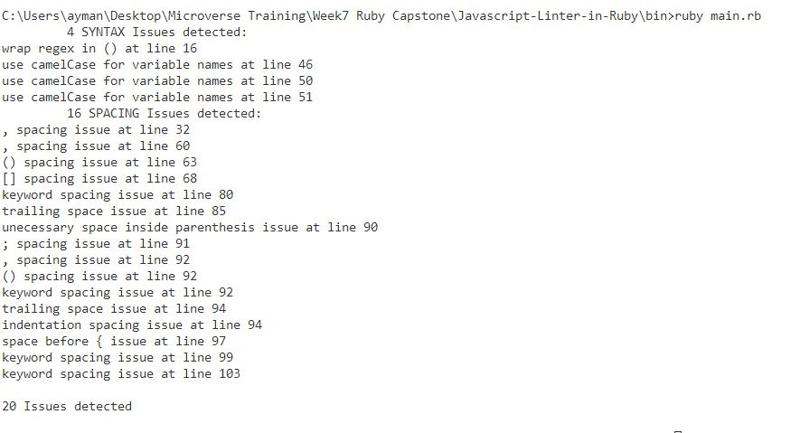

# Javascript-Linter-in-Ruby

This is a simple linter for Javascript written in Ruby, since I am planning to study Javascript in my future studies, I thought that it would be good to make a linter for it

This linter is based on the [ESLint Stylistic rules](https://eslint.org/docs/rules/#stylistic-issues)

The specific rules that I choose to implement are listed below, these are the issues, that are most likely to face beginners in Javascript

### Spacing Issues:

#### array-bracket-spacing (never)

block-spacing (always)
comma-spacing (before:false, after:true)
no-trailing-spaces
computed-property-spacing (never)
func-call-spacing (never)
semi-spacing (before: false, after: true)
key-spacing (beforeColon:false, afterColon:true)
keyword-spacing (before:true, after:true)
indent (tab)
space-before-blocks (always)
space-in-parens (never)

#### Syntax Issues:

camelcase (always)
semi
wrap-regex
prefer-exponentiation-operator

## Instructions

1) Clone or download the files and unzip them

2) Open the files and go to the "bin" folder, add the Javascript file that you wish to test to the bin folder.

3) On line 9 in the "main.rb" file, instead of "./mainTest.js" add the path to the JavascriptFile you wish to test.

4) Make sure that you have ruby installed on your local machine, [as seen here](https://www.ruby-lang.org/en/documentation/installation/)

5) Using a terminal, navigate to the "bin" folder in the main file, and run "ruby main.rb".

6) This will give you all the errors that the linter has found in your Javascript file.

## Testing with RSpec
This Linter implementation makes use of RSpec in order to test each of its linter methods, in order to test the methods with RSpec:

1) Make sure to have RSpec installed on your local machine, [as seen here](https://github.com/rspec/rspec)

2) Navigate to the "spec" folder in the main file, using a terminal.

3) run "RSpec tests_rspec.rb" or
 "RSpec tests_rspec.rb --format d"

4) The terminal should tell you how many tests passed, how many failed, and why they failed

## Author 👤

### Ayman Jabr

_[Github](https://github.com/AymanJabr/)

_[LinkedIn](https://www.linkedin.com/in/ayman-jabr-3705a4100/)

## Show your support ⭐️⭐️⭐️

Give a star if you like this project!

## License 📝

This project is [MIT](https://www.mit.edu/~amini/LICENSE.md) licensed.